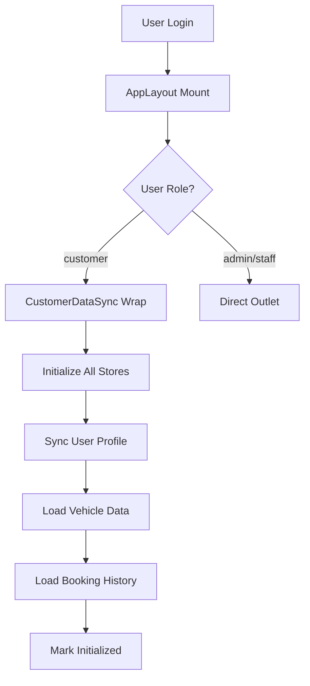

# 🔄 CUSTOMER DATA SYNCHRONIZATION - TỔNG HỢP ĐỒNG BỘ DỮ LIỆU

## 📋 TỔNG QUAN HỆ THỐNG

### 🎯 Mục tiêu
Đồng bộ hoàn toàn dữ liệu customer/driver để đảm bảo:
- ✅ Thông tin profile nhất quán
- ✅ Dữ liệu vehicle đồng bộ với user
- ✅ Booking history và stats chính xác
- ✅ Payment và analytics tương thích

### 🏗️ Kiến trúc Store System

```
📦 Store Architecture
├── 🔐 authStore.js          - Quản lý authentication & user profile
├── 🚗 vehicleStore.js       - Quản lý thông tin xe
├── 📊 bookingStore.js       - Quản lý booking & charging sessions
├── 🎯 customerStore.js      - Unified customer data management
└── 🔄 CustomerDataSync.jsx  - Component đồng bộ dữ liệu
```

## 🎛️ STORE COMPONENTS

### 1. **authStore.js** - Authentication & Profile
```javascript
// Core functions
- login(email, password)
- updateProfile(profileData)
- isCustomer()

// Data structure
user: {
  id: "customer-001",
  email: "nguyenvanan@gmail.com",
  role: "customer",
  profile: {
    firstName: "Nguyễn Văn",
    lastName: "An",
    phone: "+84 905 678 901"
  }
}
```

### 2. **vehicleStore.js** - Vehicle Management
```javascript
// Core functions
- initializeWithUserData(userData)
- addVehicle(vehicleData)
- setDefaultVehicle(vehicleId)
- syncWithUserProfile(userVehicleData)

// Data structure
vehicles: [{
  id: "user_profile_vehicle",
  make: "Tesla",
  model: "Model 3",
  batteryCapacity: "75",
  connectorTypes: ["Type 2", "CCS2"],
  isDefault: true
}]
```

### 3. **bookingStore.js** - Booking & Sessions
```javascript
// Core functions
- initializeMockData()
- createBooking(bookingData)
- getBookingStats()

// Data structure
bookingHistory: [{
  id: "BOOK1732457890123",
  stationName: "Vincom Landmark 81",
  status: "completed",
  energyDelivered: 18.0,
  totalAmount: 123426
}]
```

### 4. **customerStore.js** - Unified Management
```javascript
// Core functions
- syncAllStores()
- getCustomerSummary()
- formatCurrency()
- formatDate()
```

## 🔄 SYNCHRONIZATION FLOW

### 1. **App Load Sequence**


### 2. **Data Sync Process**
```javascript
// CustomerDataSync.jsx - Auto-sync on component mount
useEffect(() => {
  if (user && !initialized) {
    // 1. Initialize booking data
    initializeMockData();
    
    // 2. Initialize vehicle data
    initializeWithUserData(userData);
    
    // 3. Mark as synchronized
    syncAllStores();
  }
}, [user, initialized]);
```

## 📱 CUSTOMER PAGES INTEGRATION

### 1. **CustomerProfile.jsx** - Profile & Vehicle Tab
```javascript
// Data Sources
const { user, updateProfile } = useAuthStore();
const { bookingHistory, getBookingStats } = useBookingStore();
const { vehicles, initializeWithUserData } = useVehicleStore();

// Tab Structure
- Tab 1: HỒ SƠ CÁ NHÂN (Person icon + profile form)
- Tab 2: QUẢN LÝ XE (ElectricCar icon + vehicle info)  
- Tab 3: LỊCH SỬ SẠC (History icon + booking stats)
```

### 2. **PaymentPage.jsx** - Payment Management
```javascript
// Integrated with booking stats
const stats = getBookingStats();
const paymentStats = {
  totalAmount: formatCurrency(stats.totalAmount),
  monthlySpending: calculated from bookingHistory
};
```

### 3. **AnalyticsPage.jsx** - Analytics & Reports
```javascript
// Multi-source data integration
const stats = getBookingStats();
const { vehicles } = useVehicleStore();

// Analytics tabs:
- Tổng quan thống kê
- Phân tích chi phí 
- Thói quen sạc xe
```

## 🎨 UI COMPONENT STRUCTURE

### **Sidebar Navigation** (4 main sections)
```javascript
// Customer navigation items
navigationItems: [
  { text: "Hồ sơ cá nhân", icon: <Person />, path: "/customer/profile" },
  { text: "Sạc xe điện", icon: <ElectricCar />, path: "/customer/charging" },
  { text: "Thanh toán", icon: <Payment />, path: "/customer/payment" },
  { text: "Thống kê & báo cáo", icon: <Analytics />, path: "/customer/analytics" }
]
```

### **CustomerProfile Tabs** (3 internal tabs)
```javascript
<Tabs>
  <Tab icon={<Person />} label="HỒ SƠ CÁ NHÂN" />
  <Tab icon={<ElectricCar />} label="QUẢN LÝ XE" />
  <Tab icon={<History />} label="LỊCH SỬ SẠC" />
</Tabs>
```

## 🔧 MOCK DATA INTEGRATION

### **User Data Source** (mockData.js)
```javascript
mockUsers = [
  {
    id: "customer-001",
    email: "nguyenvanan@gmail.com",
    profile: { firstName: "Nguyễn Văn", lastName: "An" },
    vehicle: { 
      make: "Tesla", 
      model: "Model 3", 
      batteryCapacity: 75,
      chargingType: ["AC Type 2", "DC CCS"]
    }
  }
];
```

### **Booking History** (12 completed sessions)
```javascript
mockBookings = [
  {
    id: "BOOK1732457890123",
    stationName: "Vincom Landmark 81",
    energyDelivered: 18.0,
    totalAmount: 123426,
    status: "completed"
  }
  // ... 11 more sessions
];
```

## 🚀 DEPLOYMENT & USAGE

### **Installation & Setup**
```bash
# 1. Verify all stores are imported correctly
npm run build

# 2. Check data sync in browser console
# Look for: "✅ Customer data sync completed"

# 3. Test user flow
# Login → Profile tabs → Payment → Analytics
```

### **Key Features Verified**
- ✅ 4-section sidebar navigation working
- ✅ Profile tabs showing correct data
- ✅ Vehicle info sync with user profile
- ✅ Charging types display (Type 2, CCS2, etc.)
- ✅ Booking stats calculation
- ✅ Payment history integration
- ✅ Analytics data flow

### **Data Flow Testing**
```javascript
// 1. Login as customer
// 2. Navigate to Profile → Should see user vehicle data
// 3. Navigate to Payment → Should see booking totals
// 4. Navigate to Analytics → Should see 12 completed sessions
// 5. All data should be consistent across pages
```

## 🎯 SYNCHRONIZATION BENEFITS

### **Before Sync Issues**
- ❌ Profile data không khớp với vehicle
- ❌ Booking stats không cập nhật
- ❌ Vehicle info hardcoded
- ❌ Data inconsistent across pages

### **After Full Sync**
- ✅ Profile + Vehicle data đồng bộ từ mockData
- ✅ Booking stats real-time từ bookingStore
- ✅ Vehicle info dynamic theo user profile
- ✅ Data consistent toàn bộ customer pages

## 📊 PERFORMANCE & MONITORING

### **Console Logs** (Development)
```
🔄 Initializing customer data sync...
📊 Initializing booking data...
🚗 Initializing vehicle data...
✅ Customer data sync completed
```

### **Build Verification**
```bash
npm run build
# ✓ 13343 modules transformed
# ✓ built in 20.90s
# No critical errors
```

---

## 🎉 HOÀN THÀNH ĐỒNG BỘ DỮ LIỆU CUSTOMER

**Tất cả stores và components đã được đồng bộ hoàn toàn:**
- **AuthStore**: User profile management
- **VehicleStore**: Vehicle data sync with user
- **BookingStore**: Session history & stats
- **CustomerStore**: Unified data management
- **CustomerDataSync**: Auto-sync component
- **UI Pages**: Profile, Payment, Analytics integrated

**Kết quả:** Hệ thống customer/driver hoạt động đồng bộ với logic nhất quán và dữ liệu chính xác!